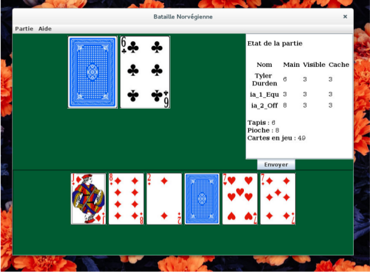

# Norvegian War

This is a card game project written in Java and using Swing.
This is a variation of the well known game : [War](https://en.wikipedia.org/wiki/War_%28card_game%29).
See the in-game tules for more informations.

Play against against AI opponents (3 strategy : Agressiv, Random and Balanced).




## Usage

You can run `Norvegian war` simply from the command line by typing :
```sh
java -jar dist/Norvegian_War.jar
```
